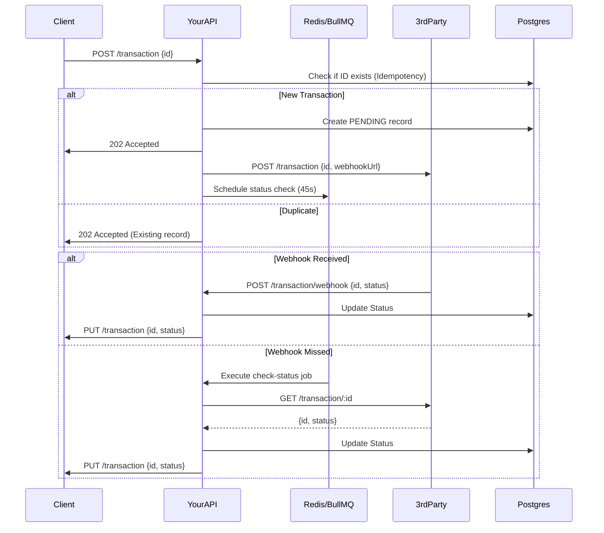

# Djamo API Take-home - Your API (NestJS)

## Overview

This is the implementation of the `your_api` service using **NestJS**. It manages money transfers by integrating with a flaky 3rd-party service, ensuring reliability through idempotency and background status polling.

## Architecture & Design Decisions

### 1. Robustness & Reliability
- **Asynchronous Processing:** The `/transaction` (POST) endpoint returns a `202 Accepted` response as quickly as possible. It registers the transaction in the database and then triggers the 3rd-party call in the background.
- **Idempotency:** We use PostgreSQL to track transaction IDs. If a duplicate request is received, the API returns the existing transaction state instead of re-triggering the external call.
- **Status Polling (The "Safety Net"):** Since the 3rd party is flaky and might miss webhooks, we use **BullMQ** (powered by Redis) to schedule a status check job for every transaction. If a webhook isn't received within 45 seconds, the background worker polls the 3rd party's status API.

### 2. Technology Stack
- **NestJS:** Chosen for its structured approach, excellent TypeScript support, and built-in modules for common tasks (HTTP, Config, etc.).
- **TypeORM & PostgreSQL:** Used for persistent storage of transaction records.
- **Redis & BullMQ:** Used for the job queue to handle background polling and status checks.
- **Axios:** For making HTTP requests to the 3rd party and client mocks.

### 3. Sequence Diagram



## Setup & Running

The entire stack is orchestrated via Docker Compose.

### Prerequisites
- Docker & Docker Compose

### Start the project
```bash
docker-compose up --build
```

### Trigger a test transaction
```bash
curl -H 'Content-Type: application/json' -X POST localhost:3100/transaction
```

## Implementation Details

- **Environment Variables:** All configuration (URLs, DB credentials) is managed via environment variables in `docker-compose.yml`.
- **Validation:** Global `ValidationPipe` is used to ensure client requests follow the expected schema (UUID validation).
- **Error Handling:** 504 errors from the 3rd party are specifically handled by triggering an immediate retry/poll schedule, as the request might still have succeeded on their side.

## Future Improvements
- **Exponential Backoff:** The current polling is simplified. In a production environment, we would implement more sophisticated exponential backoff for the status check jobs.
- **Persistent Redis:** Currently, Redis is used as a transient job queue. For better reliability across restarts, Redis persistence (RDB/AOF) should be configured.
- **Health Checks:** Adding NestJS Terminus for health check endpoints.
